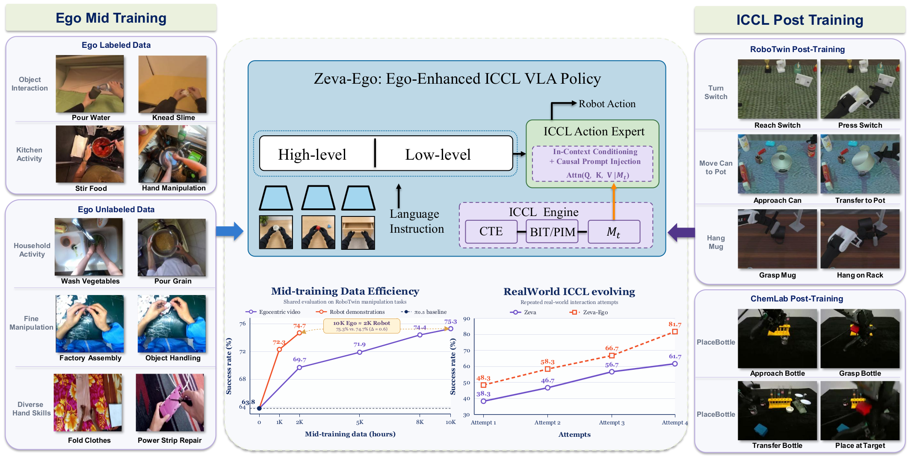

# Zeva-Ego

Zeva-Ego is a memory-augmented vision-language-action stack for RoboTwin and real-robot manipulation. The public release focuses on method implementation and training reproducibility.

[](assets/zeva_ego_teaser.pdf)

## Method

Zeva-Ego adds four components to a foundation policy:

- **CTE — Causal Transition Encoder:** recurrently encodes camera observations and the previously executed H15 action chunk.
- **BIT — Boundary Interaction Token:** the short-term state produced at the current replanning boundary.
- **EAP — Effect Action Prior:** injects task memory and the predicted effect into the policy prefix and action embeddings.
- **PIM — Persistent Interaction Memory:** retrieves longer-horizon BIT history.

Two PIM scopes are implemented:

1. **Cross-attempt PIM:** a completed attempt commits a bounded BIT trace; a later attempt in the same episode can retrieve it.
2. **Within-episode PIM:** each decision reads only BITs from strictly earlier H15 boundaries in the current episode.

The two settings share the same CTE/BIT/EAP parent and differ only in the lifetime and write boundary of PIM.

## Supported platforms

- RoboTwin
- Real robots through the OpenPI websocket server and lightweight client
- ALOHA and DROID data/policy adapters used for real-robot integration

## Repository layout

```text
src/openpi/zeva/
  cte_eap.py             CTE, BIT objectives, and EAP
  cte_eap_policy.py      RoboTwin training/deployment composition
  pim_policy.py          cross-attempt and within-episode PIM
  robotwin_contract.py   RoboTwin action/image/handoff contract
  robotwin_data.py       RoboTwin dataset adapter
  robotwin_policy.py     foundation-policy integration
  tri_stream.py          causal tri-stream sequence block
scripts/robotwin/
  train_cte.py
  export_cte_artifacts.py
  train_cte_eap.py
  build_cross_attempt_pim.py
  train_cross_attempt_pim.py
  train_within_episode_pim.py
configs/
  robotwin_pim_training_settings.json
docs/
  ROBOTWIN_REPRODUCTION.md
  REAL_ROBOT_DEPLOYMENT.md
pipelines/
  ego_action_encoder/    RGB-pair action-token encoder training and inference
  robotwin_clean/        clean-only RoboTwin post-training and randomized evaluation
```

The two `pipelines/` packages are code-only and independent of the ICCL implementation. They expect caller-provided checkpoints and already-prepared data, and do not modify `src/openpi/zeva`.

## Training and evaluation

The public recipe has four stages:

1. Train CTE/BIT for 80 epochs.
2. Export train-only task memory and H15 traces.
3. Train the foundation policy with EAP for 5000 optimizer steps.
4. Train either PIM setting for 2000 optimizer steps.

Every path is provided explicitly on the command line; the repository contains no cluster-specific paths or credentials.

See the [documentation index](docs/README.md) for installation and the ICCL training and deployment guides. Pipeline-specific commands live with their corresponding packages:

- [Ego action encoder](pipelines/ego_action_encoder/README.md) provides the two-stage visual action encoder, release training recipes, and RGB-pair inference API.
- [RoboTwin Clean](pipelines/robotwin_clean/README.md) provides the Joint14 / chunk-start-relative EEF16 clean post-training and randomized evaluation boundary.

## Real-robot deployment

The policy server and lightweight robot client are documented in [real-robot deployment](docs/REAL_ROBOT_DEPLOYMENT.md).

## Reproducibility and safety

- CTE consumes only past executed actions.
- Within-episode PIM reads only strictly earlier BITs.
- Cross-attempt PIM commits memory only at an explicit attempt reset.
- Episode reset clears all recurrent and persistent state.
- Checkpoints contain model, adapter, optimizer state, and per-rank RNG state.
- Output directories must be empty; training never silently overwrites a run.

## License

See [LICENSE](LICENSE), [LICENSE_GEMMA.txt](LICENSE_GEMMA.txt), and [THIRD_PARTY_NOTICES.md](THIRD_PARTY_NOTICES.md).
