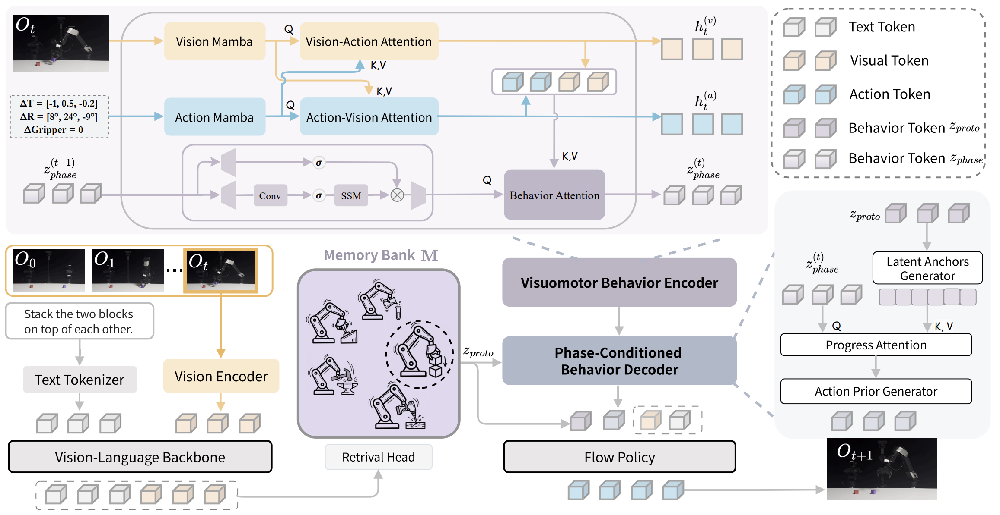

<div align="center">

# From Abstraction to Instantiation:<br>Learning Behavioral Representation for Vision-Language-Action Model

### BehaviorVLA · ICML 2026 Oral

[Bing Hu](https://mrok24.github.io/hubing.github.io/)<sup>1</sup>,
[Zaijing Li](https://lizaijing.github.io/)<sup>1,2</sup>,
[Rui Shao](https://rshaojimmy.github.io/OrionLab/)<sup>1,2,3,†</sup>,
[Junda Chen](https://openreview.net/profile?id=~Junda_Chen2)<sup>1</sup>,
[April Hua Liu](https://openreview.net/profile?id=~April_Hua_Liu1)<sup>4</sup>,
[Wei-Shi Zheng](https://www.isee-ai.cn/~zhwshi/)<sup>3,5</sup>,
[Liqiang Nie](https://liqiangnie.github.io/)<sup>1</sup>

<sup>1</sup>Harbin Institute of Technology, Shenzhen &nbsp;
<sup>2</sup>PengCheng Laboratory &nbsp;
<sup>3</sup>Shenzhen Loop Area Institute<br>
<sup>4</sup>Shanghai University of Finance and Economics &nbsp;
<sup>5</sup>Sun Yat-sen University

<sup>†</sup>Corresponding author

[](https://arxiv.org/abs/2605.22671)
[](https://mrok24.github.io/BehaviorVLA/)
[](LICENSE)

</div>

## Updates

- **2026-07:** Released the training and evaluation pipeline.
- **2026-05:** BehaviorVLA is accepted to **ICML 2026 Oral**.
- **2026-05:** The [paper](https://arxiv.org/abs/2605.22671) and [project page](https://mrok24.github.io/BehaviorVLA/) is released.

## Overview

Vision-Language-Action models can degrade under distribution shifts because action-centric latent variables often fragment long-horizon behavior and remain statically aligned during execution. **BehaviorVLA** instead learns a temporally coherent behavioral representation and uses it to guide action generation at both task and execution-phase levels.

The framework contains two symmetric components:

- **Visuomotor Behavior Encoder (VBE):** a causal Mamba-based encoder that aggregates complete trajectories into task-level behavior representations and estimates the current execution phase online from vision and the previous action.
- **Phase-conditioned Behavior Decoder (PBD):** retrieves a stable global behavior prototype from a key-value memory and combines it with the evolving local phase token to condition the flow policy.

<p align="center">
  <a href="https://mrok24.github.io/BehaviorVLA/">
    
  </a>
</p>

If you are interested in our work, please also see [iLearn-Lab/CVPR26-OptimusVLA](https://github.com/iLearn-Lab/CVPR26-OptimusVLA), our related work on memory-augmented vision-language-action models.

## Installation

### Requirements

- Linux with an NVIDIA GPU.
- Python 3.11.
- A CUDA toolkit compatible with PyTorch 2.7.1.
- [`uv`](https://docs.astral.sh/uv/).

Create the environment and install BehaviorVLA:

```bash
GIT_LFS_SKIP_SMUDGE=1 uv sync
source .venv/bin/activate
GIT_LFS_SKIP_SMUDGE=1 uv pip install -e .
```

Install the bundled CUDA extensions in order. Build isolation is disabled so both extensions compile against the PyTorch version in the project environment:

```bash
uv pip install --no-build-isolation ./causal-conv1d
uv pip install --no-build-isolation ./mamba
```

Verify the extensions:

```bash
python -c \
  "import causal_conv1d, mamba_ssm; print(causal_conv1d.__version__, mamba_ssm.__version__)"
```

Apply the local Transformers replacements required by the PyTorch pi0.5 implementation:

```bash
cp -r src/openpi/models_pytorch/transformers_replace/* \
  .venv/lib/python3.11/site-packages/transformers/
```

## Data and Checkpoints

The commands below use `/path/to/...` placeholders. Prepare:

1. A LIBERO dataset converted to the LeRobot format.
2. A pretrained pi0.5 PyTorch checkpoint containing `model.safetensors`.
3. LIBERO quantile normalization statistics at:

```text
/path/to/pi05_base/assets/physical-intelligence/libero/norm_stats.json
```

Update the LIBERO paths in `src/openpi/training/config.py` before training the full policy.

## Training

BehaviorVLA is trained in three stages. Stage 1 learns the behavior representation and constructs its memory, Stage 2 fine-tunes the full policy, and Stage 3 aligns VLM features with memory retrieval keys.

### Stage 1: Train the Visuomotor Behavior Encoder

The BehaviorEncoder consumes complete LIBERO trajectories. Images use the `[-1, 1]` range, and actions use the same pi0.5 quantile normalization statistics as the full policy.

```bash
CUDA_VISIBLE_DEVICES=0 PYTHONPATH=src python \
  src/openpi/BehaviorEncoder/train.py \
  --dataset_root /path/to/libero/dataset \
  --norm_stats_dir /path/to/pi05_base/assets/physical-intelligence/libero \
  --save_dir /path/to/behavior_encoder/output \
  --epochs 80 \
  --batch_size 8
```

One checkpoint is saved after every epoch. For example:

```text
/path/to/behavior_encoder/output/behavior_model_ep80.pth
```

Build the key-value behavior memory with the selected BehaviorEncoder checkpoint:

```bash
CUDA_VISIBLE_DEVICES=0 PYTHONPATH=src python \
  src/openpi/BehaviorEncoder/build_memory.py \
  --ckpt /path/to/behavior_encoder/output/behavior_model_ep80.pth \
  --data_root /path/to/libero/dataset \
  --save_path /path/to/libero/memory_bank.pt \
  --device cuda
```

Each memory entry stores a normalized 128-dimensional `retrieval_key`, a 256-dimensional `behavior_value`, and its episode/task metadata.

### Stage 2: Train the Full BehaviorVLA Policy

Configure the following paths before launching training:

- `src/openpi/training/config.py`
  - LIBERO LeRobot dataset.
  - pi0.5 base checkpoint and normalization assets.
  - output checkpoint directory.
- `src/openpi/models/pi0_config.py`
  - `behavior_encoder_ckpt` from Stage 1.
  - `memory_bank_path` from Stage 1.

The retrieval head is intentionally not loaded during Stage 2 because the training model is constructed with `is_training=True`.

The following command trains on GPUs 0-3 with a global batch size of 256, corresponding to 64 samples per GPU without gradient accumulation:

```bash
CUDA_VISIBLE_DEVICES=0,1,2,3 PYTHONPATH=src \
torchrun --standalone --nnodes=1 --nproc_per_node=4 \
  scripts/train_pytorch.py pi05_libero \
  --exp_name behaviorvla_libero \
  --batch_size 256 \
  --num_train_steps 30000 \
  --save_interval 1000
```

Checkpoints are written to:

```text
/path/to/behaviorvla/checkpoints/pi05_libero/behaviorvla_libero/<step>/
```

Each step directory contains `model.safetensors`, `metadata.pt`, optimizer state, and LIBERO normalization assets.

Resume from the latest checkpoint in the experiment directory with:

```bash
CUDA_VISIBLE_DEVICES=0,1,2,3 PYTHONPATH=src \
torchrun --standalone --nnodes=1 --nproc_per_node=4 \
  scripts/train_pytorch.py pi05_libero \
  --exp_name behaviorvla_libero \
  --batch_size 256 \
  --num_train_steps 30000 \
  --save_interval 1000 \
  --resume
```

### Stage 3: Train the Retrieval Head

The retrieval head maps 2048-dimensional pi0.5 VLM features into the 128-dimensional behavior-memory key space. The provided script first extracts one normalized source feature per LIBERO episode and then trains the projection head.

```bash
GPU=0 \
CHECKPOINT=/path/to/behaviorvla/checkpoints/pi05_libero/behaviorvla_libero/30000 \
SOURCE_PATH=/path/to/libero/source_features.pt \
MEMORY_BANK=/path/to/libero/memory_bank.pt \
SAVE_DIR=/path/to/retrieval/head/output \
FORCE_EXTRACT=1 \
bash scripts/train_libero_retrieval_head.sh
```

The final retrieval checkpoint is saved as:

```text
/path/to/retrieval/head/output/best_model.pth
```

Before evaluation, update these fields in `src/openpi/models/pi0_config.py`:

```python
retrieval_ckpt = "/path/to/retrieval/head/output/best_model.pth"
behavior_encoder_ckpt = "/path/to/behavior_encoder/output/behavior_model_ep80.pth"
memory_bank_path = "/path/to/libero/memory_bank.pt"
```

## LIBERO Evaluation

Evaluation uses a policy server and a separate LIBERO client. The server maintains episode-level state, including the retrieved global behavior token and previous action.

### Start the Policy Server

The policy directory must be a specific step directory containing `model.safetensors` and `assets/`:

```bash
CUDA_VISIBLE_DEVICES=0 PYTHONPATH=src python scripts/serve_policy.py \
  --env LIBERO \
  --port 8000 \
  policy:checkpoint \
  --policy.config pi05_libero \
  --policy.dir /path/to/behaviorvla/checkpoints/pi05_libero/behaviorvla_libero/30000
```

Wait until the policy checkpoint, retrieval head, memory bank, and BehaviorEncoder are loaded before starting the client.

### Run the LIBERO Object Client

In another terminal, evaluate `libero_object` with seed 7:

```bash
PYTHONPATH="${PYTHONPATH:-}:$PWD/third_party/libero" \
CUDA_VISIBLE_DEVICES=0 python examples/libero/main.py \
  --args.host 127.0.0.1 \
  --args.port 8000 \
  --args.task_suite_name libero_object \
  --args.num_trials_per_task 50 \
  --args.seed 7 \
  --args.log_file eval/libero/libero_object_results.jsonl \
  --args.video_out_path eval/libero/videos/libero_object
```

The JSONL output contains a `run_summary` record with the episode count, success count, and success rate. Keep `--args.seed 7` unchanged when comparing checkpoints.

## Acknowledgements

BehaviorVLA is built on [OpenPI](https://github.com/Physical-Intelligence/openpi) and uses components from [Mamba](https://github.com/state-spaces/mamba), [causal-conv1d](https://github.com/Dao-AILab/causal-conv1d), and [LIBERO](https://github.com/Lifelong-Robot-Learning/LIBERO). See `LICENSE`, `LICENSE_GEMMA.txt`, and the licenses in the bundled third-party directories.

## Citation

If you find BehaviorVLA useful in your research, please cite:

```bibtex
@article{hu2026abstraction,
  title={From Abstraction to Instantiation: Learning Behavioral Representation for Vision-Language-Action Model},
  author={Hu, Bing and Li, Zaijing and Shao, Rui and Chen, Junda and Liu, April Hua and Zheng, Wei-Shi and Nie, Liqiang},
  journal={arXiv preprint arXiv:2605.22671},
  year={2026}
}
```
